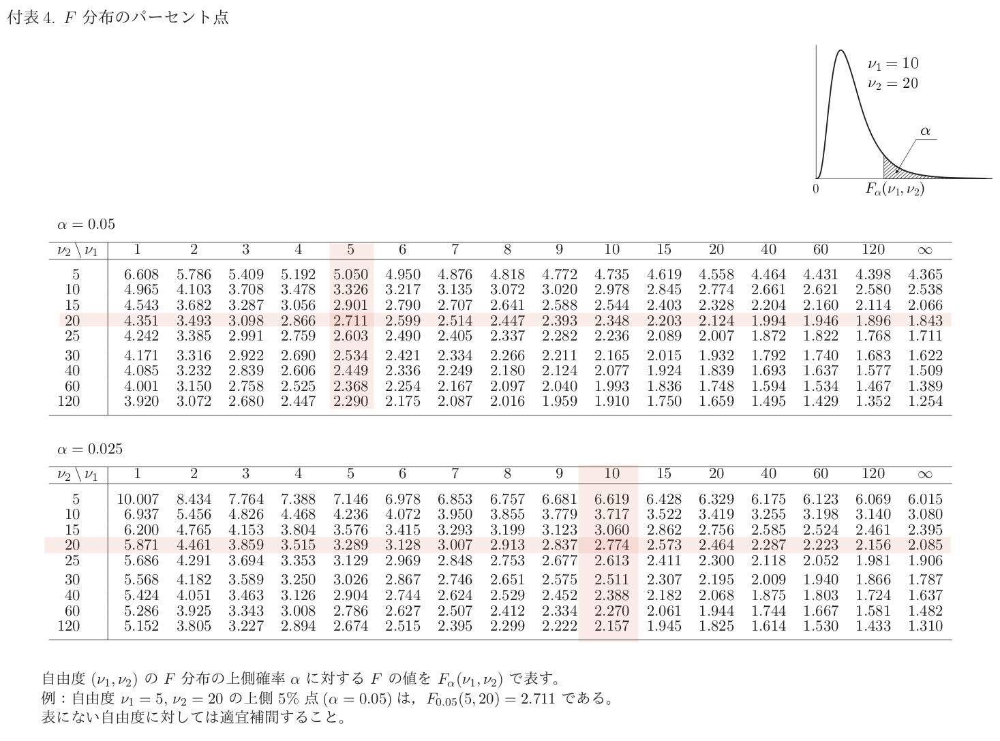

```{r setup, include=FALSE}
library(learnr)
knitr::opts_chunk$set(echo = FALSE)
```

奥村 (2016) §2.5〜 を参考にしています。

## 1 命名規則  {#sec1}

R で量的な確率変数を扱うときには次のような名前がついた関数を扱います。

- `d____`: 確率密度関数
- `p____`: 累積分布関数
- `q____`: 分位点関数
- `r____`: 乱数生成関数

`____` の部分には分布を表すキーワードが入ります。例えば，正規分布の場合は `norm` をつけて，次のような関数名になります。

- `dnorm`
- `pnorm`
- `qnorm`
- `rnorm`

以下は R で使える関数の一例です。

|                        | 密度関数 `d____` | 累積分布関数 `p____` | 分位点関数 `q____` | 乱数生成関数 `r____` |
|------------------------|------------------|----------------------|--------------------|----------------------|
| 正規分布 `_norm`       | `dnorm`          | `pnorm`              | `qnorm`            | `rnorm`              |
| カイ2乗分布 `_chisq`   | `dchisq`         | `pchisq`             | `qchisq`           | `rchisq`             |
| t-分布 `_t`            | `dt`             | `pt`                 | `qt`               | `rt`                 |
| コーシー分布 `_cauchy` | `dcauchy`        | `pcauchy`            | `qcauchy`          | `rcauchy`            |
| F-分布 `_f`            | `df`             | `pf`                 | `qf`               | `rf`                 |
| 指数分布 `_exp`        | `dexp`           | `pexp`               | `qexp`             | `rexp`               |
| ポアソン分布 `_pois`   | `dpois`          | `ppois`              | `qpois`            | `rpois`              |


### 問題


```{r random-name-1, echo=FALSE}
quiz(caption = "問題",
  #
  # 1st Question
  #
  question("ベータ分布の累積分布関数を計算する関数の名前は？",
    answer("qbeta"),
    answer("betap"),
    answer("pbeta", correct = TRUE),
    answer("pgamma"),
    random_answer_order = TRUE,
    allow_retry = TRUE),
  #
  # 2nd Question
  #
  question("幾何分布の分位点関数を計算する関数の名前は？",
    answer("dgeom"),
    answer("pgeom"),
    answer("qgeom", correct = TRUE),
    answer("rgeom"),
    random_answer_order = TRUE,
    allow_retry = TRUE)
)
```


## 2. 使い方を調べる  {#sec2}

分布によって必要なパラメータが変わってきます。例えば，

- 正規分布は期待値と標準偏差
- t-分布は自由度

など。使い方を学ぶためにはドキュメントを読みます。

```{r help-dnorm, exercise=TRUE}
?dnorm
```


### Usage と Arguments

Usage の読み方を確認しておきましょう。 `dnorm` のヘルプには次のように書いてあります。

```
Usage

dnorm(x, mean = 0, sd = 1, log = FALSE)
```

このような表現を関数の「シグネチャー」と呼びます。カッコの中に `=` で値を設定しているもの（`mean`, `sd`, `log`）と，そうでないもの `x` があます。

- `=` で値が設定されているパラメータ（arguments）は，オプションパラメータです。省略した場合は `=` の右側のデフォルト値が使われます。
- `=` で値が設定されていないパラメータは，必須パラメータです。普通は省略できません（ときどき例外があります！例： `dt` の `ncp` など）。

`dnorm` の `mean`, `sd` はオプションです。`dnorm(0.5)` とすると，`mean = 0`, `sd = 1` が使われます。それぞれのパラメータが何を意味しているかは Arguments の項を見ればわかります。

シグネチャーに表示されている順にパラメータを渡していくというのが基本です。

- `dnorm(0, 1, 2)` は `dnorm(x = 0, mean = 1, sd = 2)` と同じことです。
- パラメータ名を書く場合は順序を入れ替えることもできます（`dnorm(sd = 2, mean = 0, x = 10)`）が，特別な事情がない限りは避けましょう。


### 問題

```{r help-random-func, exercise=TRUE}

```


```{r random-usage-1, echo=FALSE}
quiz(caption = "問題",
  #
  # 1st Question
  #
  question("以下の記述のうち，正しい記述を1つ選びなさい。",
    answer("rt(10) は自由度1 の t分布に従って乱数を10個生成する"),
    answer("rchisq(10, 5) は自由度10のカイ2乗分布に従って乱数を5個生成する"),
    answer("rcauchy(10) は必要なパラメータが不足しておりエラーになる"),
    answer("rf(10, 2, 3) は自由度(2,3) のF分布に従って乱数を10個生成する", correct = TRUE),
    random_answer_order = TRUE,
    allow_retry = TRUE),
  #
  # 2nd Question
  #
  question("幾何分布の分位点関数を計算する関数の名前は？",
    answer("dgeom"),
    answer("pgeom"),
    answer("qgeom", correct = TRUE),
    answer("rgeom"),
    random_answer_order = TRUE,
    allow_retry = TRUE)
)
```


## 3. 中心極限定理 {#sec3}

```{r clt-sandbox, exercise=TRUE}
# ここで実験してください

```

```{r clt, echo=FALSE}
quiz(caption = "中心極限定理",
  #
  # 1st Question
  #
  question("次のコードのうち，ヒストグラムが正規分布を近似しないものはどれか。",
    answer("hist(replicate(1000, mean(rgeom(1000, 0.2))))"),
    answer("hist(replicate(1000, mean(runif(1000))))"),
    answer("hist(replicate(1000, mean(rcauchy(1000, 0.2))))", correct = TRUE, message = "コーシー分布には期待値・分散が存在しないので，中心極限定理が成立しない。"),
    answer("hist(replicate(1000, mean(rt(1000, 5))))"),
    random_answer_order = TRUE,
    allow_retry = TRUE),
  #
  # 2nd Question
  #
  question("$X_1,\\dots,X_n$ が期待値 $\\mu$, 分散 $\\sigma^2$ の独立同一分布にしたがう。$\\bar X$ の近似分布は ...",
    answer("$\\mathcal{N}(0, 1)$"),
    answer("$\\mathcal{N}(\\mu, 1)$"),
    answer("$\\mathcal{N}(\\mu, \\sigma^2/n)$", correct = TRUE),
    answer("$\\mathcal{N}(\\mu, \\sigma^2)$"),
    random_answer_order = TRUE,
    allow_retry = TRUE)
)
```

## 4. 標準化 {#sec4}

確率変数 $X$ の期待値が $\mu$, 分散が $\sigma^2$ であるとする。このとき，
$Z = aX + b$ ($a,b$ は定数) の期待値は $a\mu +b$, 分散は $a^2\sigma^2$ になる。

$X$ を1次変換して $Z = aX + b$ を期待値0, 分散1 にすることを，標準化という。

$$
a\mu + b = 0,\qquad
a^2 \sigma^2 = 1
$$
となるような $a, b$ を求めればよいので，

$$
a = \frac{1}{\sigma},
\qquad
b = - \frac{\mu}{\sigma}
$$
とすればよい。すなわち，

$$
Z = \frac{X - \mu}{\sigma}
$$

データを標準化するときには，標本平均と標本標準偏差を使う。

$$
Z = \frac{X - \bar{X}}{s}
$$


### 問題

`x` を標準化してヒストグラムを描きなさい。

```{r standardize-1, exercise=TRUE}
x <- rnorm(1000, mean = 100, sd = 30)


```

```{r standardize-1-hint}
z <- (x - 100) / 30
```


### 偏差値

テストの成績では平均50, 標準偏差が 10 (分散が 100) になるようにする。

$$
a\mu + b = 50,\qquad
a^2 \sigma^2 = 100
$$

を解いて

$$
a = \frac{10}{\sigma},\qquad
b = 50 - \frac{10\mu}{\sigma}
$$

とする。すなわち，

$$
U = 50 + 10 \left(\frac{X - \mu}{\sigma}\right) = 50 + 10Z
$$

これを偏差値という。データの偏差値は

$$
U = 50 + 10 \left(\frac{X - \bar{X}}{s}\right)
$$

で計算する。

#### 問題

次の成績データ `score` をもとに偏差値を計算しなさい。

```{r standardize-2, exercise=TRUE, exercise.lines = 8}
score <- c(30, 84, 63, 79, 82, 68, 57, 64, 61, 53, 54, 69, 
           81, 77, 55, 65, 62, 31, 41, 52, 86, 78, 76, 33, 
           40, 35, 59, 43, 34, 42, 56, 80, 60, 47, 90, 88, 
           48, 67, 58, 32)


```

```{r standardize-2-hint}
u <- 50 + 10 * (x - mean(x)) / sd(x)
```


## 5. 正規分布 {#sec5}

### $\pm k\sigma$

確率変数 $X$ が正規分布 $\mathcal{N}(\mu, \sigma^2)$ に従っているとする。
このとき，$X$ が $[\mu - \sigma, \mu + \sigma]$ の範囲に入る確率

$$
\mathrm{Prob}(
  \mu - \sigma \le X \le \mu + \sigma 
)
$$

は，

$$
\mathrm{Prob}(
  \mu - \sigma \le X \le \mu + \sigma 
)
=
\mathrm{Prob}(
   - \sigma \le X - \mu \le \sigma 
)
=
\mathrm{Prob}\left(
   - 1\le \frac{X - \mu}{\sigma} \le 1 
\right)
$$

が成り立つので標準正規分布に従う確率変数 $Z$ が $[-1, 1]$ の範囲に入る確率と等しい。

これは

```{r, echo = TRUE}
pnorm(1) - pnorm(-1)
```

によって計算できる。


#### 問題

確率変数 $X$ が正規分布 $\mathcal{N}(\mu, \sigma^2)$ に従っているとする。
このとき，

1. $X$ が $[\mu - 2\sigma, \mu + 2\sigma]$ の範囲に入る確率
2. $X$ が $[\mu - 3\sigma, \mu + 3\sigma]$ の範囲に入る確率

を求めなさい。

```{r normal-prob, exercise = TRUE}


```


### 標本平均

期待値 $\mu$, 分散 $\sigma^2$ の確率変数から出てきたデータ
$X_1,\dots,X_n$ の標本平均 $\bar X$ は $\mathcal{N}(\mu, \sigma^2/n)$ 
に近い分布を持っている。

$\bar X$ を標準化するともっと使いやすくなる。すなわち，

$$
Z = \frac{\bar{X} - \mu}{\sqrt{\sigma^2 / n}}
$$
の分布は標準正規分布 $\mathcal{N}(0, 1)$ で近似できる。

標準正規分布を使いこなせれば多くのことができる。


## 6. 正規分布から導かれる分布 {#sec6}

### 6.1 カイ2乗分布

$X_1, \dots, X_n$ は独立に $\mathcal{N}(0,1)$ に従う確率変数とする。

```{r random-vars, echo=FALSE}
quiz(caption = "問題",
  #
  # 1st Question
  #
  question("$X_1^2 + \\cdots + X_n^2$ が従う分布は",
    answer("自由度 $n$ のカイ2乗分布", correct = TRUE),
    answer("自由度 $n$ のt-分布"),
    answer("自由度 $(n, 1)$ のF-分布"),
    answer("$\\mathcal{N}(n, 1)$"),
    random_answer_order = TRUE,
    allow_retry = TRUE)
)
```

自由度5 のカイ2乗分布が 10以上の値を取る確率は次のようにして計算できる。

```{r chisq, exercise=TRUE}
1 - pchisq(10, df = 5)
```

2乗和（例えば誤差など）を分析したい場合には，カイ2乗分布が使える。

正規分布の2乗和が本当にカイ2乗分布になるか？確かめてみよう。

```{r chisq-hist, exercise = TRUE}
hist(replicate(1000, sum(rnorm(5) ^ 2)), freq = FALSE)
curve(dchisq(x, df = 5), add = TRUE)
```


### 6.2 t-分布

t-分布をスローガン的に表現すると次のようになる。（正確な定義は統計学の教科書を見よう）

$$
t(n) = \frac{\mathcal{N}(0,1)}{\sqrt{\chi^2(n)/n}}
$$

これは不偏分散を使って標準化するときにでてくる。

$$
\frac{\bar{X} - \mu}{\sqrt{s^2  / n}}
=
\frac{(\bar{X} - \mu)/\sqrt{\sigma^2/n}}
{\sqrt{\sum_{i=1}^n [(X_i - \bar{X})/\sigma]^2  / (n - 1)}}
$$

は自由度 $(n-1)$ の t-分布に従う。


```{r t-vars, echo=FALSE}
quiz(caption = "問題",
  #
  # 1st Question
  #
  question("t-分布について正しい記述をすべて選びなさい。",
    answer("自由度 1 のt-分布はコーシー分布と一致する", correct = TRUE),
    answer("自由度が無限大になると t-分布は正規分布に収束する", correct = TRUE),
    answer("自由度が大きい t-分布ほど外れ値の発生確率が高い"),
    answer("t-分布を用いた統計分析には母分散の情報が不可欠である"),
    random_answer_order = TRUE,
    allow_retry = TRUE)
)
```


自由度$n$ の t-分布に従う確率変数 $X$ が95% の確率で値を取る範囲

$\mathrm{Prob}(- L \le X \le L) = 0.95$

を求めるには，`qt` を使う。


```{r qt, exercise = TRUE}
qt(1 - 0.025, df = 5)
```


#### 問題

99% の確率で $X$ が値をとる範囲はどのようにして求めるか？

```{r qt2, exercise = TRUE}

```


#### 問題

教科書や検定試験では下図のような上側 $\alpha\%$ 点に関する表が掲載されている場合が多い。例えば， $\nu = 20$, $\alpha = 0.025$ に対して $t_{0.025}(20) = 2.086$ とある。

{ width=500px }

これをRで計算するにはどうすればよいか？ヒント：`qt` を使う。

```{r qt3, exercise = TRUE}

```


### 6.3. F-分布

F-分布をスローガン的に表現すると次のようになる。正確な定義は統計学の教科書を見よう。

$$
F(n_1, n_2) = \frac{\chi^2(n_1) / n_1}{\chi^2(n_2) / n_2}
$$

分散の比を調べるときに使う。R では `df`, `pf`, `qf`, `rf` という関数が使える。

カイ2乗分布とF分布の関係について，自由度（`n1`, `n2`）を変えて実験してみよう。

```{r hist-f, exercise = TRUE}
n1 <- 10
n2 <- 20
numerator <- rchisq(1000, df = n1) / n1
denominator <- rchisq(1000, df = n2) / n2
# カイ2乗分布の比のヒストグラム
hist(numerator / denominator, breaks = 30, freq = FALSE)
# F(n1, n2) の密度関数を重ね書き
curve(df(x, df1 = n1, df2 = n2), add = TRUE)
```


#### 問題

教科書や検定試験では下図のような上側 $\alpha\%$ 点に関する表が掲載されている場合が多い。例えば， $\nu_1 = 5$, $\mu_2 = 20$, $\alpha = 0.05$ に対して $F_{0.05}(5, 20) = 2.711$ とある。

{ width=600px }

これをRで計算するにはどうすればよいか？

```{r qf1, exercise = TRUE}

```


#### 問題

上の表を用いれば $F_{0.025}(10, 20) = 2.774$ を計算することができる。
F-分布に従う確率変数が $95\%$ の確率で収まる領域を

$$
F_{0.975}(10, 20) \le F(10, 20) \le F_{0.025}(10, 20)
$$

によって算出したいとする。上の表を使って $F_{0.975}(10, 20)$ を計算するにはどうすればよいか？ 

まずは `qf` を使わずに表を使って計算しなさい。そのあとで `qf` を使って結果を確認しよう。


```{r qf2, exercise = TRUE}

```


```{r qf2-hint}
# qf(0.975, 10, 20) と qf(0.025, 20, 10) の関係は？
```
